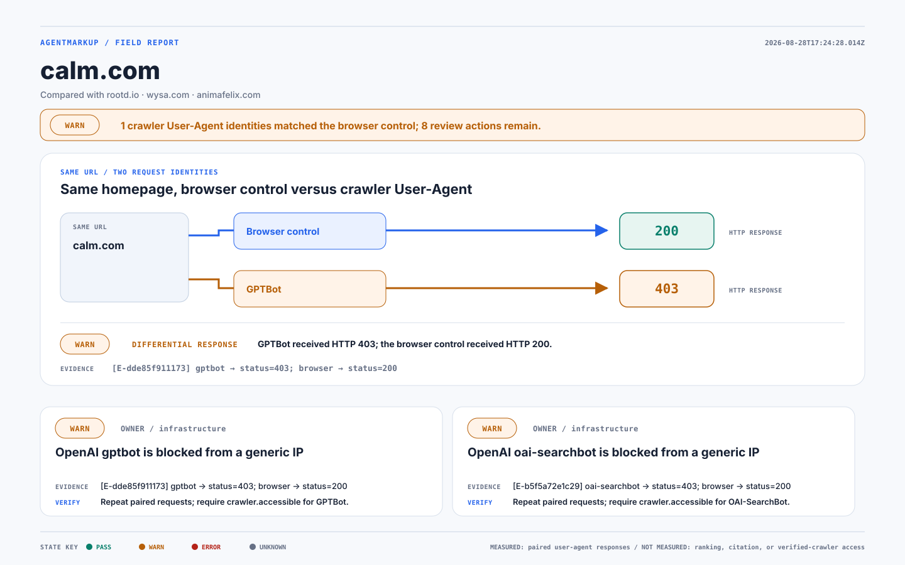

# AgentMarkup field report

Generated 2026-08-28T17:24:28.014Z from @agentmarkup/audit@0.2.5. Subject: https://calm.com. Compared with: https://rootd.io, https://wysa.com, https://animafelix.com.

## Outcome

**1 crawler User-Agent identities matched the browser control; 8 review actions remain.**

Observed subject findings: 5 PASS, 8 WARN, 0 ERROR, 0 UNKNOWN, 13 total. A capability with no emitted finding is NOT_REPORTED. No shared denominator or readiness score is calculated.



## Live proof: same URL, two request identities

| Request identity | Observed response | Evidence receipt |
| --- | --- | --- |
| Browser control | 200 | E-dde85f911173 |
| GPTBot User-Agent | 403 | E-dde85f911173 |

GPTBot received HTTP 403; the browser control received HTTP 200.

These are simulated User-Agent requests from this runner. Verified crawler IP access was not tested.

## Machine-readable surface

| Capability | calm.com | rootd.io | wysa.com | animafelix.com |
| --- | --- | --- | --- | --- |
| GPTBot User-Agent access | WARN (E-dde85f911173) | WARN (E-db3faed95061) | WARN (E-f5e0a42984f4) | PASS (E-0c7b983c60f0) |
| OAI-SearchBot User-Agent access | WARN (E-b5f5a72e1c29) | WARN (E-fe07775c57d8) | WARN (E-f47979e42845) | PASS (E-11c04eb754c5) |
| ClaudeBot User-Agent access | WARN (E-8b623aaf0d55) | WARN (E-32bd883c5fb7) | WARN (E-99b15669800f) | PASS (E-57d69d452f15) |
| PerplexityBot User-Agent access | WARN (E-168f138127c1) | WARN (E-7c6305652b23) | WARN (E-8d533469c74c) | PASS (E-6b44c15e4285) |
| Google-Extended User-Agent access | PASS (E-96cdc2db26ea) | PASS (E-bfe7558db6c7) | PASS (E-28517045df28) | PASS (E-ee5d38aa709b) |
| Content without JavaScript | PASS (E-02e5585585e2) | PASS (E-cc7894fa6c9a) | PASS (E-0a907f3b9ff6) | PASS (E-ad4dfebc2219) |
| robots.txt crawler policy | PASS (E-9d5e7378e00b) | PASS (E-0a91921d325b) | PASS (E-0a0193beee4b) | PASS (E-1040e078a9b7) |
| Content-Signal policy | WARN (E-d2df9e587e55) | WARN (E-934cb0e7d666) | WARN (E-cdfa8b88cbf7) | WARN (E-5cb7b963b5ef) |
| llms.txt manifest | WARN (E-d8ec15d2abd1) | WARN (E-f6c2393e6909) | WARN (E-16e192684a60) | PASS (E-335a45bfb870) |
| llms.txt homepage discovery | NOT_REPORTED | NOT_REPORTED | NOT_REPORTED | NOT_REPORTED |
| JSON-LD structured data | WARN (E-c8bfd6782b53) | WARN (E-77081991b6ca) | PASS (E-9cb863627123) | PASS (E-4a8c3be61f67) |
| Markdown alternate | NOT_REPORTED | NOT_REPORTED | NOT_REPORTED | PASS (E-00159fceb4bf) |
| Sitemap discovery | PASS (E-40e8be6758b9) | PASS (E-c2878c0aca9a) | PASS (E-7bc6071fd5f3) | PASS (E-04925ace34f7) |
| Core page metadata | WARN (E-ae9f65808bd1) | WARN (E-ee2710bb79e5) | PASS (E-858f13fe5400) | PASS (E-9122a0f1fea6) |
| Missing-path HTTP behavior | PASS (E-999ac4b3d0a8) | PASS (E-1c03159a6594) | PASS (E-f677f5140431) | PASS (E-f39e75b67e3f) |

## Crawl-access scoreboard

```diff
- calm.com        █████░░░░░░░░░   5/14  4 crawler User-Agents refused
- rootd.io        █████░░░░░░░░░   5/14  4 crawler User-Agents refused
- wysa.com        ███████░░░░░░░   7/14  4 crawler User-Agents refused
+ animafelix.com  █████████████░  13/14  readable by every crawler identity tested
```

## Matched peer differences

- **GPTBot User-Agent access:** subject WARN (E-dde85f911173); animafelix.com PASS (E-0c7b983c60f0). Owner: infrastructure.
- **OAI-SearchBot User-Agent access:** subject WARN (E-b5f5a72e1c29); animafelix.com PASS (E-11c04eb754c5). Owner: infrastructure.
- **ClaudeBot User-Agent access:** subject WARN (E-8b623aaf0d55); animafelix.com PASS (E-57d69d452f15). Owner: infrastructure.
- **PerplexityBot User-Agent access:** subject WARN (E-168f138127c1); animafelix.com PASS (E-6b44c15e4285). Owner: infrastructure.
- **llms.txt manifest:** subject WARN (E-d8ec15d2abd1); animafelix.com PASS (E-335a45bfb870). Owner: agentmarkup.
- **JSON-LD structured data:** subject WARN (E-c8bfd6782b53); wysa.com PASS (E-9cb863627123). Owner: agentmarkup.
- **JSON-LD structured data:** subject WARN (E-c8bfd6782b53); animafelix.com PASS (E-4a8c3be61f67). Owner: agentmarkup.
- **Core page metadata:** subject WARN (E-ae9f65808bd1); wysa.com PASS (E-858f13fe5400). Owner: content owner.
- **Core page metadata:** subject WARN (E-ae9f65808bd1); animafelix.com PASS (E-9122a0f1fea6). Owner: content owner.

## Action queue

### E-dde85f911173 — OpenAI gptbot is blocked from a generic IP

- **State:** WARN; basis: direct-observation
- **Observed:** gptbot → status=403; browser → status=200
- **Owner:** infrastructure
- **Review action:** If a WAF rule blocks the "gptbot" user-agent, remove or narrow it. If you allowlist verified bots by IP, no action is needed.
- **Done when:** Repeat paired requests; require crawler.accessible for GPTBot.
- **Peer proof:** animafelix.com explicitly passed this capability.

### E-b5f5a72e1c29 — OpenAI oai-searchbot is blocked from a generic IP

- **State:** WARN; basis: direct-observation
- **Observed:** oai-searchbot → status=403; browser → status=200
- **Owner:** infrastructure
- **Review action:** If a WAF rule blocks the "oai-searchbot" user-agent, remove or narrow it. If you allowlist verified bots by IP, no action is needed.
- **Done when:** Repeat paired requests; require crawler.accessible for OAI-SearchBot.
- **Peer proof:** animafelix.com explicitly passed this capability.

### E-8b623aaf0d55 — Anthropic claudebot is blocked from a generic IP

- **State:** WARN; basis: direct-observation
- **Observed:** claudebot → status=403; browser → status=200
- **Owner:** infrastructure
- **Review action:** If a WAF rule blocks the "claudebot" user-agent, remove or narrow it. If you allowlist verified bots by IP, no action is needed.
- **Done when:** Repeat paired requests; require crawler.accessible for ClaudeBot.
- **Peer proof:** animafelix.com explicitly passed this capability.

### E-168f138127c1 — Perplexity perplexitybot is blocked from a generic IP

- **State:** WARN; basis: direct-observation
- **Observed:** perplexitybot → status=403; browser → status=200
- **Owner:** infrastructure
- **Review action:** If a WAF rule blocks the "perplexitybot" user-agent, remove or narrow it. If you allowlist verified bots by IP, no action is needed.
- **Done when:** Repeat paired requests; require crawler.accessible for PerplexityBot.
- **Peer proof:** animafelix.com explicitly passed this capability.

### E-d8ec15d2abd1 — No llms.txt found

- **State:** WARN; basis: audit-derived
- **Observed:** No reachable /llms.txt. This is optional — it helps AI coding tools and some assistants, but major crawlers do not require it.
- **Owner:** agentmarkup
- **Review action:** Generate llms.txt with agentmarkup if you want a curated agent manifest.
- **Done when:** Rerun @agentmarkup/audit@0.2.5 and require llms.present.
- **Peer proof:** animafelix.com explicitly passed this capability.

### E-c8bfd6782b53 — No JSON-LD structured data

- **State:** WARN; basis: audit-derived
- **Observed:** The page has no JSON-LD. Structured data helps AI systems and search understand the page entity.
- **Owner:** agentmarkup
- **Review action:** Add JSON-LD with agentmarkup schema presets (webSite, organization, article, …).
- **Done when:** Rerun @agentmarkup/audit@0.2.5 and require jsonld.present.
- **Peer proof:** wysa.com, animafelix.com explicitly passed this capability.

### E-ae9f65808bd1 — Core page metadata is incomplete

- **State:** WARN; basis: direct-observation
- **Observed:** missing: canonical
- **Owner:** content owner
- **Review action:** Add the missing head tags; agentmarkup keeps these consistent on generated pages.
- **Done when:** Rerun @agentmarkup/audit@0.2.5 and require meta.complete.
- **Peer proof:** wysa.com, animafelix.com explicitly passed this capability.

### E-d2df9e587e55 — No Content-Signal policy in robots.txt

- **State:** WARN; basis: audit-derived
- **Observed:** Content-Signal in robots.txt is the canonical place to state training/search/ai-input preferences. It may still be set as an HTTP header, which fewer tools read.
- **Owner:** agentmarkup
- **Review action:** Enable agentmarkup contentSignalHeaders so Content-Signal is written into robots.txt.
- **Done when:** Rerun @agentmarkup/audit@0.2.5 and require robots.content-signal.

## Generated review pack

- `brief.svg` — one-page stage visual; `report.md` remains the text source of truth.
- `fix-pack.md` — evidence-to-owner-to-review-action-to-recheck handoff.
- `llms.txt` — grounded review draft.
- `robots-patch.txt` — POLICY INPUT REQUIRED.
- `studio-handoff.md` — self-contained handoff; it does not rely on access to local files.

## Evidence and coverage

- https://calm.com: OK; 5 PASS / 8 WARN / 0 ERROR / 0 UNKNOWN / 13 observed; fetched 2026-08-28T17:24:19.467Z; raw audit-0.json.
- https://rootd.io: OK; 5 PASS / 8 WARN / 0 ERROR / 0 UNKNOWN / 13 observed; fetched 2026-08-28T17:24:19.246Z; raw audit-1.json.
- https://wysa.com: OK; 7 PASS / 6 WARN / 0 ERROR / 0 UNKNOWN / 13 observed; fetched 2026-08-28T17:24:19.262Z; raw audit-2.json.
- https://animafelix.com: OK; 13 PASS / 1 WARN / 0 ERROR / 0 UNKNOWN / 14 observed; fetched 2026-08-28T17:24:19.226Z; raw audit-3.json.
- Subject grounding: homepage 200 (565142 bytes; final https://www.calm.com/); robots.txt 200.

Full evidence receipts are in `evidence.json`; raw audit findings remain in `audit-*.json`.

## What this proves — and what it does not

- **Measured:** public responses observed under a browser User-Agent and named crawler User-Agent strings; reported machine-readable signals; matched peer differences.
- **Not measured:** assistant citations, rankings, traffic, third-party authority, or access from verified crawler IP ranges.
- **Unknown:** 0 domain(s); NOT_REPORTED cells remain neutral and are excluded from matched gaps.
- Hostname validation is textual only. Findings are a live snapshot and can change after this run.
